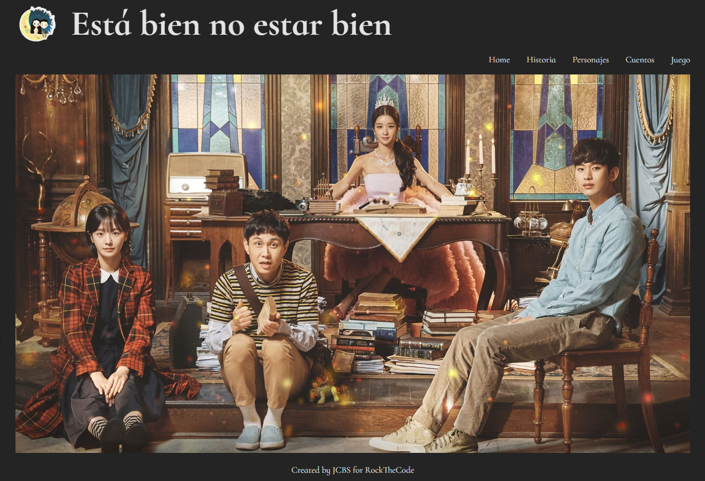
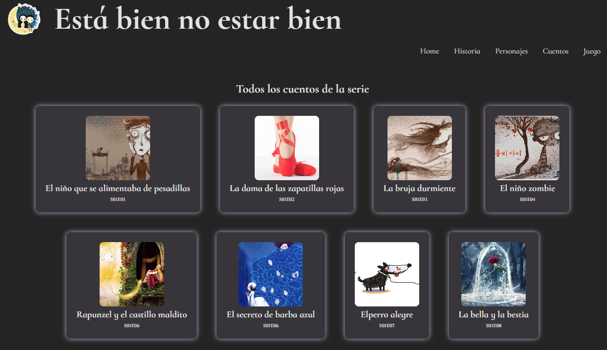
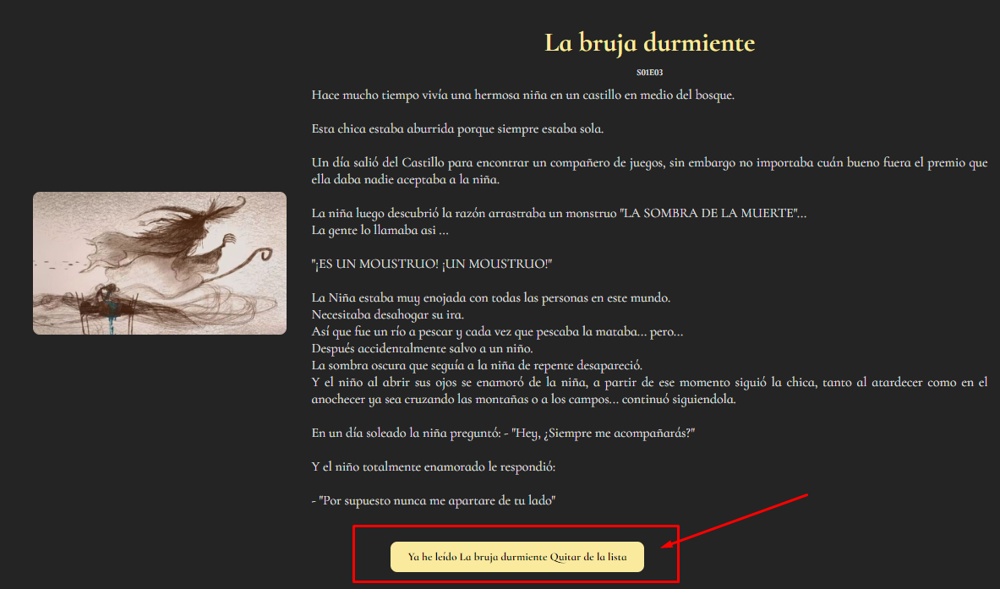
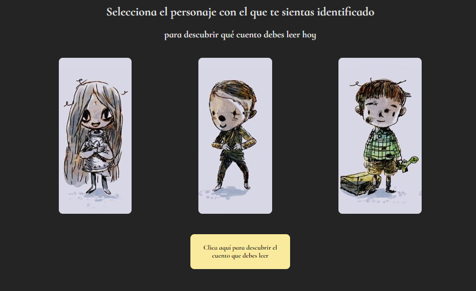

# Está bien no estar bien

Es una SPA que recoge los aspectos fundamentales de la serie coreana "Está bien no estar bien".
Está realizada con React, practicando React Router Dom.

  

En la sección de cuentos podemos encontrar todos los cuestos de la serie y clicando sobre las card podemos leer el contenido del cuento

 

Una vez leído el cuento, podemos seleccionar quitarlo de nuestra lista

  

En la sección "Juego", puedes escoger entre el alter ego de los personajes principales, cuál cuento te recomiendan leer, el cual debes descubrir clicando el botón inferior

Espero que la aplicación te guste tanto como me gustó realizarla.

Si tienes algún comentario al código, no dudes en contactarme.